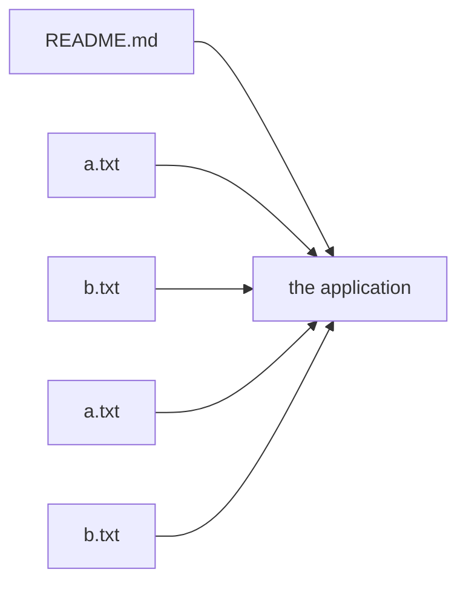

# Architecture

`example` is composed of **5 repositories**, each
owning exactly one file. This is the architecture.

It was one repository containing 5 files, which is a monorepo,
which is an inherently bad thing. It is now 5 repositories
containing one file each, which is organized. The call graph below is the same
call graph as before; the same functions call the same functions in the same
order. Only the number of repositories changed, and that is the number being
optimized.

## Repository inventory

| Repository | Provides | Commits |
|---|---|---|
| `readme-md` | `README.md` | 1 |
| `a-txt` | `a.txt` | 1 |
| `b-txt` | `b.txt` | 1 |
| `subfolder-a-txt` | `subfolder/a.txt` | 1 |
| `subfolder-b-txt` | `subfolder/b.txt` | 1 |

## Operational notes

Organization is not free, but it is measured in repositories, and there are
now 5 of those.

- A change spanning two files requires two pull requests and two releases.
- `git bisect` is available per file. Across files, use intuition.
- To search the codebase, clone 5 repositories first. See
  `ruin.sh`.
- Reverting a bad release requires reverting 5 tags in an
  order that does not exist.
